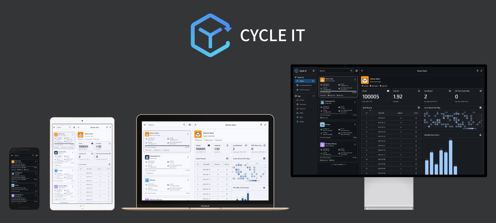
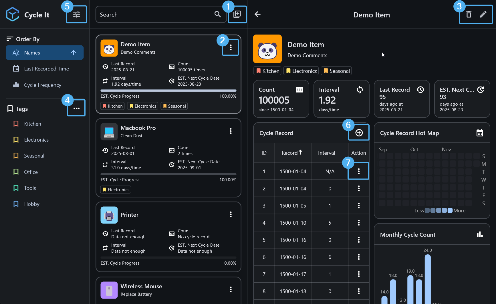

    
    
    
        
    
    

<h2 align="center">Cycle It</h2>

<h3 align="center">Track · Predict · Remind</h1>

Keep your recurring tasks organized — never forget again.

## 📖 Introduction
In daily life, many items follow a usage cycle: electric toothbrushes need regular charging, water filters require periodic replacement, and batteries must be renewed from time to time.
Unfortunately, most of these items are **not smart enough** — they don’t show usage status and won’t remind you when maintenance is due. As a result, you may often forget and end up facing awkward moments, like picking up your toothbrush only to find it out of power.

**CycleIt · 循物** is a cross-platform app built to solve this problem.
It records usage history, tracks recurring cycles, predicts the next due date, and sends reminders — helping you avoid both forgetfulness and waste.

## ✨ Features
* 📝 **Item Management**: Record item names, notes, and assign emoji icons for quick identification.
* 🔄 **Cycle Tracking**: Display usage records in a table, with sorting by date or interval.
* 📊 **Data Visualization**: Analyze usage patterns with stats like cycle count and duration; visualize with heatmap calendar and monthly bar chart.
* 📅 **Smart Prediction**: Estimate the next due date based on historical data.
* 🔔 **Timely Reminders**: Get notifications when it’s time for the next cycle.
* 🔍 **Quick Search**: Find items instantly by name or notes.
* 🏷️ **Tag Management**: Assign multiple tags and filter items by tag.
* 📱 **Responsive UI**: Adapts layout automatically to screen size.
* 🌐 **Cross-Platform**: Runs on iOS, Android, Windows, and macOS.
* 🌍 **Multi-Language**: Supports English, Simplified Chinese, and Traditional Chinese.
* 🎨 **Theme Switching**: Light/Dark themes with system auto-switch.
* 💾 **Database Management**: Import/export database for backup and device migration.

## 📦 Installation
### Android
Download and install [Cycle.It.1.0.3.apk](https://github.com/Siriusq/cycle_it/releases/download/1.0.3/Cycle.It.1.0.3.apk).

### iOS
Not available on the App Store. Instead, download the IPA package [Cycle.It.1.0.3](https://github.com/Siriusq/cycle_it/releases/download/1.0.3/Cycle.It.1.0.3.ipa) and sideload it using [AltStore](https://altstore.io/). See [AltStore FAQ](https://faq.altstore.io/) for setup instructions.

### Windows
**Due to RAMageddon, I can't afford a new PC. Currently, I only have a MacBook, which doesn't allow me to test on the Windows platform, so support for Windows will be discontinued after version 1.0.2.**
Available on the Microsoft Store, install directly from the store. 

### macOS
Download and install [Cycle.It.1.0.3.dmg](https://github.com/Siriusq/cycle_it/releases/download/1.0.3/Cycle.It.1.0.3.dmg).

### Linux
**Due to system limitations, core functions cannot be implemented, so the Linux version will no longer be updated.**

Currently supports only Debian-based distributions. Download and install [cycle\_it\_v1.deb](https://github.com/Siriusq/cycle_it/releases/download/1.0/cycle_it_v1.deb).

## 🎬 User Guide

    

### Add Item
Tap the **Add button** in the top-right corner of the item list. 1️⃣

### Edit Item
* Tap the **More Actions button** on the item card → **Edit**. 2️⃣
* Or, tap the **Edit button** in the top-right corner of the item details page. 3️⃣

### Manage Tags
Tap the **More Actions button** in the tag section of the sidebar. 4️⃣

On mobile, open the sidebar via the **drawer button** in the top-left of the item list.

### Settings
Tap the **Settings button** in the top-right corner of the sidebar. 5️⃣

On mobile, open the sidebar via the **drawer button**.

### Add Cycle Record
* Tap the **More Actions button** on the item card → **Cycle It**. 2️⃣
* Or, tap the **Add button** in the cycle record table on the item details page. 6️⃣

### Manage Cycle Records
In the cycle record table on the item details page, tap the **Actions button** at the end of the record row. 7️⃣

## ⚠️ Known Issues
* **Cycle prediction & reminders**: Requires at least two cycle records as a reference. For new items, you may manually add estimated past records to enable prediction.
* **Splash Screen**: When opening the app via a notification, the splash screen may not display the app icon ([More info](https://github.com/jonbhanson/flutter_native_splash/issues/739)).
* **Notification Permission**: On first launch, some platforms require granting notification permissions.
* **Expired reminders**: On some platforms, if the device is powered off at the scheduled reminder time, the reminder will not trigger after the device is turned on again.

### Platform Limitations
* **Windows**
  * Only MSIX package provided — EXE cannot properly handle scheduled notifications ([details](https://pub.dev/packages/flutter_local_notifications#windows-limitations)).
* **Android**
  * Import/export database may not work on Android < 13 (tested on Android 15).
  * Notification scheduling requires allowing the app to run in the background. See [Scheduled Android notifications](https://pub.dev/packages/flutter_local_notifications#scheduled-android-notifications) and [Don’t Kill My App](https://dontkillmyapp.com/).
* **iOS**
  * Supports only up to 64 scheduled notifications (system limit). [More info](https://pub.dev/packages/flutter_local_notifications#ios-pending-notifications-limit).
  * Sideloaded apps via AltStore must be refreshed every 7 days.
* **macOS**
  * Notifications supported only on macOS 10.14 or later ([details](https://pub.dev/packages/flutter_local_notifications#macos-differences)).
* **Linux**
  * No scheduled notification API, so reminders are unavailable ([details](https://pub.dev/packages/flutter_local_notifications#linux-limitations)).
  * Only Debian-based installer provided (because I’m lazy).

## 🗓️ Todo
> Big promises ahead — please don’t expect too much from this lazy dev 🐶

* Smarter cycle prediction.
* Cross-platform sync via OneDrive/iCloud.

## 🙏 Credits
* Flutter
* Android Studio
* ChatGPT
* Google Gemini
* [Appainter](https://appainter.dev/)
* [create-dmg](https://github.com/sindresorhus/create-dmg)
* [Photopea](https://www.photopea.com/)
* [DeviceShot](https://deviceshots.com/)
* Awesome packages from pub.dev (file\_picker, permission\_handler, getx, drift, flutter\_local\_notifications, timezone, window\_manager, data\_table\_2, flex\_color\_picker, emoji\_picker\_flutter, simple\_heatmap\_calendar, material\_charts, shared\_preferences, json\_theme, flutter\_native\_splash, chinese\_font\_library, url\_launcher, flutter\_launcher\_icons, msix, etc.)
