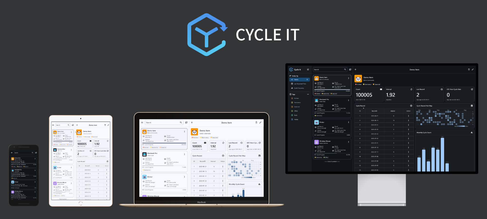
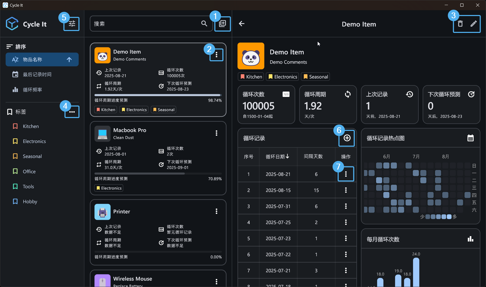

<h1 align="center">Cycle It · 循物</h1>

<h3 align="center">记录 · 预测 · 提醒</h1>

让物品的循环使用更有条理，不再遗忘。

    
    
        
    
    

# 📖 简介
生活中有很多物品存在使用周期：电动牙刷需要定期充电、净水器滤芯需要定期维护、设备电池需要定期更换……这些物品往往不够智能，既没有余量显示，也不会主动提醒，结果就是常常忘记维护，导致使用时“罢工”。

**CycleIt · 循物** 正是为了解决这一痛点而生的一款跨平台应用。它能记录物品的使用历史，追踪循环周期，并在下次使用日期到来时提醒你，避免遗忘与浪费。

---

# ✨ 功能特性
- 📝 **物品管理**：记录名称、备注，支持设置 emoji 图标快速识别。
- 🔄 **循环追踪**：表格化展示物品使用记录，支持日期和间隔排序。
- 📊 **数据可视化**：统计循环次数与周期，支持日历热点图、月度柱状图展示规律。
- 📅 **智能预测**：根据历史数据推算下次使用日期。
- 🔔 **贴心提醒**：在循环周期到达时推送通知，不再遗漏。
- 🔍 **快速搜索**：通过名称或备注定位物品。
- 🏷️ **标签管理**：支持多标签分类与筛选。
- 📱 **响应式 UI**：根据屏幕尺寸自适应布局。
- 🌐 **跨平台支持**：iOS、Android、Windows、macOS、Linux 全覆盖。
- 🌍 **多语言切换**：简体中文、繁体中文、英文。
- 🎨 **主题切换**：支持明暗模式，跟随系统自动切换。
- 💾 **数据库管理**：支持数据导入导出，轻松迁移或备份。

---

# 📦 安装说明
## Android
下载并安装 [cycle\_it\_v1.apk](https://github.com/Siriusq/cycle_it/releases/download/1.0/cycle_it_v1.apk)。

## iOS
由于不打算上架 App Store，仅提供 IPA 包 [CycleIt.ipa](https://github.com/Siriusq/cycle_it/releases/download/1.0/CycleIt.ipa)。
需配合 [AltStore](https://altstore.io/) 进行自签名侧载，详见 [AltStore 文档](https://faq.altstore.io/)。

## Windows
下载 [cycle\_it\_v1.msix](https://github.com/Siriusq/cycle_it/releases/download/1.0/cycle_it_v1.msix)。
由于 MSIX 限制，需要先安装我的签名证书，步骤如下：
1. 右键单击安装包，依次选择`属性`-`数字签名`-`详细信息`-`查看证书`-`安装证书`
2. 在证书导入向导中，选择存储位置为`本地计算机`，点击`下一步`
3. 选择`将所有的证书都放入下列存储`
4. 点击`浏览`，选择`受信任的根证书颁发机构`
5. 点击下一步并完成证书导入
6. 双击安装包进行安装即可

（更详细的步骤图文教程：我的博客，还没写完QwQ）

## macOS
下载并安装 [Cycle.It.1.0.0.dmg](https://github.com/Siriusq/cycle_it/releases/download/1.0/Cycle.It.1.0.0.dmg)。

## Linux
目前仅支持 Debian 系，下载并安装 [cycle\_it\_v1.deb](https://github.com/Siriusq/cycle_it/releases/download/1.0/cycle_it_v1.deb)。

---

# 🎬 使用指南

    

## 添加物品
在物品列表页右上角点击 **添加按钮**。1️⃣

## 编辑物品
- 在物品卡片右上角点击 **更多操作按钮** → **编辑**。2️⃣
- 或在物品详情页右上角点击 **编辑按钮**。3️⃣

## 管理标签
在侧边栏标签区域点击 **更多操作按钮**。4️⃣
移动设备需先点击物品列表页左上角的 **抽屉按钮** 打开侧边栏。

## 设置
在侧边栏右上角点击 **设置按钮** 进入设置页面。5️⃣
移动设备同样需先通过 **抽屉按钮** 打开侧边栏。

## 添加循环记录
- 在物品卡片右上角点击 **更多操作按钮** → **循环记录**。2️⃣
- 或点击物品详情页循环表格右上角的 **添加按钮**。6️⃣

## 管理循环记录
在物品详情页的循环表格中，点击对应记录右侧的 **更多操作按钮**。7️⃣

---

# ⚠️ 已知问题
- **循环预测与提醒**：预测下次使用日期并发送通知，至少需要两条循环记录作为参考。若刚添加物品，可根据估算补录两条历史记录以启用此功能。
- **启动显示问题**：通过点击通知启动应用时，启动页（Splash Screen）可能不会显示应用图标。
- **通知权限**：应用首次启动时，部分平台需要先授予通知权限，才能进入 APP。

## 平台限制
- **Windows**
	- 由于 MSIX 的限制，需手动信任我的个人证书（因为不想买昂贵的官方证书）
	- 仅提供 msix 包，因为exe 格式无法正确管理计划通知，详见 [Windows limitations](https://pub.dev/packages/flutter_local_notifications#windows-limitations)
- **Android**
	-  Android 13（API 级别 33）以下可能无法导入/导出数据库，测试环境为 Android 15（API 级别 35）。
	-  通知功能需要允许应用后台运行，详见 [Scheduled Android notifications](https://pub.dev/packages/flutter_local_notifications#scheduled-android-notifications)。关于不同品牌的安卓手机如何开启应用后台运行，详见 [Don’t kill my app! \| Hey Android vendors, don’t kill my app!](https://dontkillmyapp.com/)
- **iOS**
	-  最多仅支持 64 个计划通知（系统限制），详见 [iOS pending notifications limit](https://pub.dev/packages/flutter_local_notifications#ios-pending-notifications-limit)
	-  使用 AltStore 侧载需每 7 天刷新一次
- **macOS**
	-  通知功能仅支持 macOS 10.14 及以上，详见 [macOS differences](https://pub.dev/packages/flutter_local_notifications#macos-differences)
- **Linux**
	- 缺乏计划通知 API，无法提供到期提醒，详见 [Linux limitations](https://pub.dev/packages/flutter_local_notifications#linux-limitations)
	- 仅提供 Debian 系安装包（因为我懒）

---

# 🗓️ Todo
> 画大饼环节，请不要对本懒狗抱太大期待 🐶

- 更智能的周期预测
- OneDrive/iCloud 云同步

---

# 🙏 鸣谢
- Flutter
- Android Studio
- ChatGPT
- Google Gemini
- [Appainter](https://appainter.dev/)
- [create-dmg](https://github.com/sindresorhus/create-dmg)
- [Photopea](https://www.photopea.com/)
- [DeviceShot](https://deviceshots.com/)
- pub.dev 上的优秀开源包（file\_picker、permission\_handler、getx、drift、flutter\_local\_notifications、timezone、window\_manager、data\_table\_2、flex\_color\_picker、emoji\_picker\_flutter、simple\_heatmap\_calendar、material\_charts、shared\_preferences、json\_theme、flutter\_native\_splash、chinese\_font\_library、url\_launcher、flutter\_launcher\_icons、msix 等）
